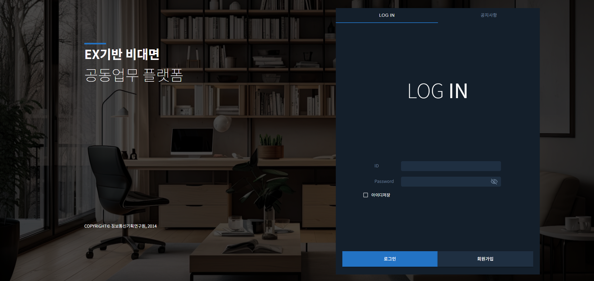

## 🏗️ 프로젝트 경험

### 1. 비대면 프로젝트 (조직/사용자 관리 시스템)

- **기간**: 2024.10 ~ 2024.12
- **역할**: 프론트엔드 및 서버 구축
- **기술 스택**: React.js, React Query, Redux Toolkit, Nginx, Pm2
- **주요 기여**:
  - 조직/사용자 CRUD 기능 및 위치 기반 등록·수정·삭제 기능 구현
  - SMS 알림 서비스 개발
  - 조직별 앱 사용량 통계 차트 시각화
  - 조직 공지사항 관리 및 엑셀 다운로드 기능 개발
- **성과**:
  - 다수 조직사 및 사용자 데이터 통합 관리 체계 확립
  - 관리자 편의성 향상 및 운영 효율 증대

## 

### 2. 모니터링 점검 시스템

- **기간**: 2024.05 ~ 2024.07
- **역할**: 백엔드/풀스택 개발
- **기술 스택**: PostgreSQL, Node.js, Express, React.js, Redux Toolkit, Pm2, Ubuntu, Photoshop
- **주요 기여**:
  - DB 설계 및 개발 설계 문서 작성
  - Selenium 기반 실시간 크롤링 및 상태 점검 기능 구현
  - 크롤링 결과에 따른 텔레그램 알림봇 개발
  - 실시간 서버 로그 데이터 연동 API 구축
  - 프로그램 UI 설계 및 프론트엔드 연동
- **성과**:

  - 실시간 점검 시스템 구축으로 장애 대응 시간 단축
  - 모니터링 자동화로 운영 인력 부담 완화

    폐쇄망 이미지 x

---

### 3. 환경알리미

- **기간**: 2023.10 ~ 2024.01
- **역할**: 풀스택 개발
- **기술 스택**: React.js, React Query, PostgreSQL, AWS EC2, Ubuntu, Photoshop
- **주요 기여**:
  - 기상 데이터 관리 프로그램 및 사용자 웹사이트 구축
  - 맞춤형 기상 데이터 시각화 및 사용자 표출 기능 개발
  - 홍보용 영상 및 이미지 제작
- **성과**:

  - 지역 맞춤형 기상 데이터 제공으로 활용성 확대
  - 사용자 친화적 UI/UX 제공

  

---

### 4. 예산 스마트시티

- **기간**: 2022.12 ~ 2023.08
- **역할**: 프론트엔드 개발
- **기술 스택**: React.js
- **주요 기여**:
  - 스마트 정류장, 횡단보도, 가로등 등 스마트 시설 데이터 시각화
  - 차트/테이블 기반 상태 관리 UI 개발
  - 시설 제어 기능(버튼 클릭 기반) 구현
- **성과**:

  - 수작업 시설 관리 → 웹 기반 관리 전환
  - 현장 운영 효율성 및 데이터 신뢰성 향상

  폐쇄망 이미지 x

  ***

  ### 4. 박스수출 공장 MES

- **기간**: 2025.03 ~ 2025.09
- **역할**: 프론트엔드 개발
- **기술 스택**: React, Redux, React Query, Ant Design
- **주요 기여**:
  - **유저 관리 화면**: 사용자 등록, 권한 관리, ID 중복체크, 비밀번호 초기화 기능
  - **검사 이미지 업로드**: 사진 미리보기/삭제 기능, 서버 연동 API 구축
  - **공정 관리 UI**: Select Box, Modal, Confirm/Warning 창을 활용한 직관적 UX 제공
- **성과**:
  - 관리자가 직접 **생산 라인 사용자 등록/수정 가능**
  - 기존 수작업 Excel 관리 → **웹 기반 관리로 전환**

---
